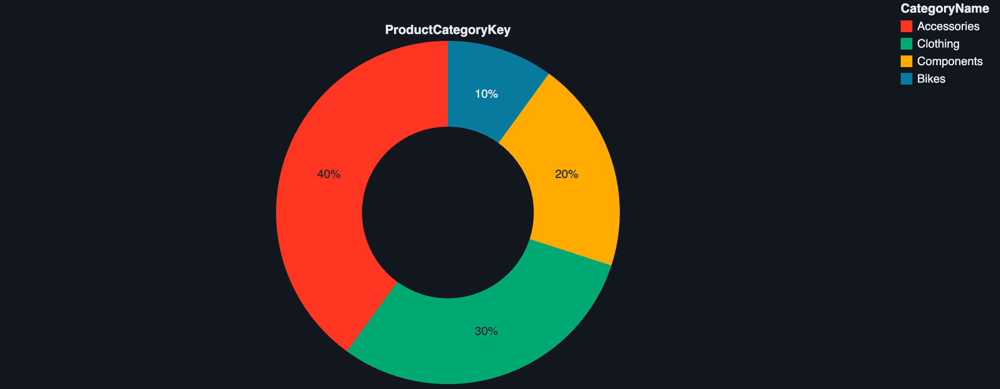

# Azure End-to-End Data Engineering Project

This repository showcases an end-to-end data engineering pipeline using Microsoft Azure services, inspired by Ansh Lamba's full project tutorial.

## 🔍 Project Overview

Build and orchestrate a complete data pipeline using Azure services, from raw data ingestion to transformation, data warehousing, and insightful reporting.

## 🛠️ Tech Stack

* **Azure Data Factory (ADF)** – for orchestrating and scheduling data ingestion
* **Azure Data Lake Storage Gen2** – as the data lake for storing Bronze/Silver/Gold layers
* **Azure Databricks** – for transformation using PySpark
* **Apache Spark** – for big data processing
* **Azure Synapse Analytics** – for external tables and data warehousing
* **Databricks** – for data visualization

## 🧱 Architecture

* **Bronze Layer**: Raw data ingested from REST API using ADF
* **Silver Layer**: Cleaned and transformed using Databricks (PySpark)
* **Gold Layer**: Business-ready datasets stored in Azure Synapse Analytics

## 📂 Folder Structure

```
.
├── sql_scripts
│   ├── Create external table.sql
│   └── Create views gold.sql
├── visuals
│   ├── visualization/total-order.png
│   ├── visualization/country-sales.png
│   └── visualization/categories.png
├── README.md
```

## 📌 Key Steps

1. Created Azure free account & necessary resources (ADF, Lake, Databricks, Synapse)
2. Ingested dataset from Kaggle/API using Azure Data Factory into Data Lake
3. Created Bronze-Silver-Gold architecture using Delta Lake and Databricks
4. Used PySpark for transformation
5. Built external tables and views in Synapse
6. Created Visualization for analysis

## 📊 Visualizations

* 
* 
* 

## 📈 Learning Outcomes

* Hands-on with Lakehouse architecture
* Real-time ETL orchestration
* Strong grasp of working with Spark SQL and Synapse
* Data storytelling using Visualization

## 📎 References

* [Project Video](https://www.youtube.com/watch?v=0GTZ-12hYtU&t=1187s)
* [Original Dataset](https://www.kaggle.com/datasets/ukveteran/adventure-works)
